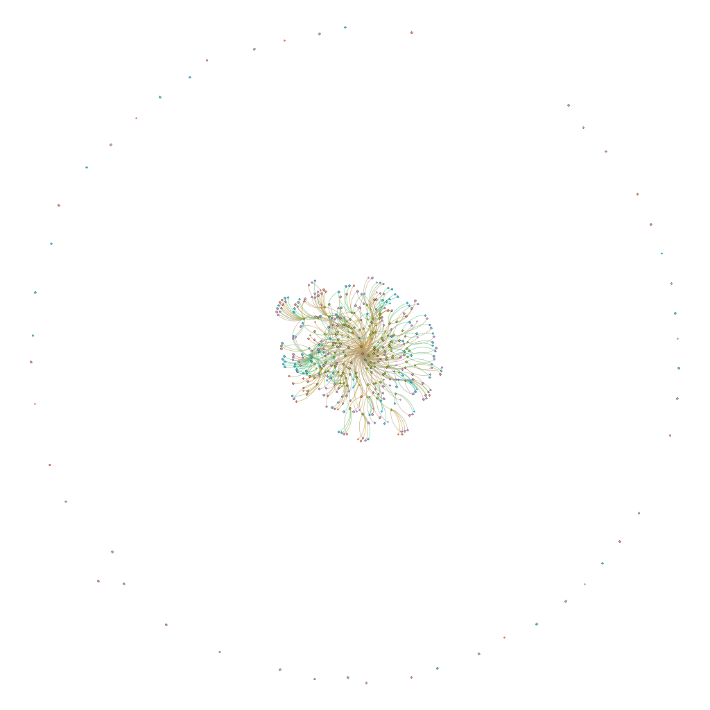
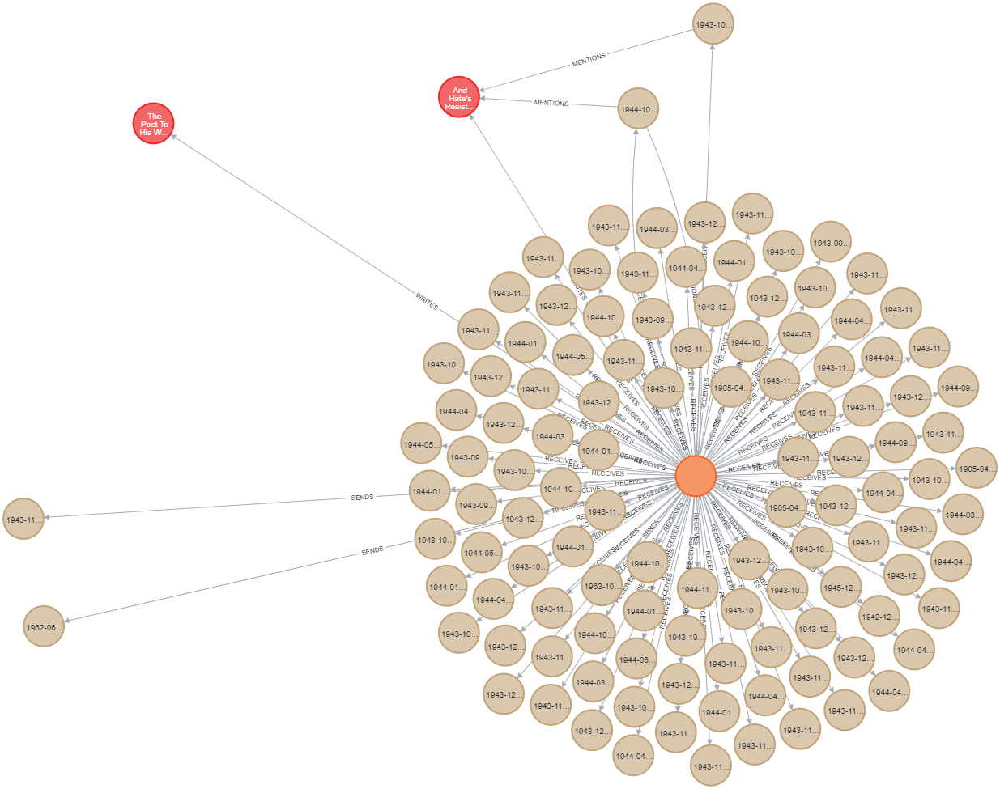
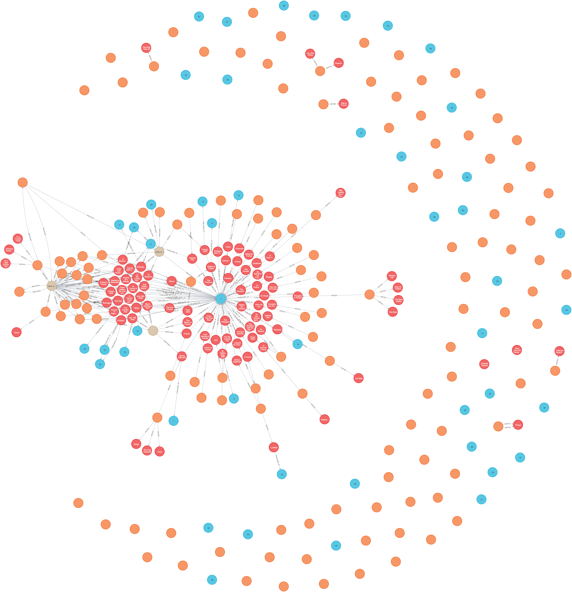

- [Poems For France](#poems-for-france)
  - [Graph](#graph)
    - [All Nodes and Edges](#all-nodes-and-edges)
  - [Example Queries](#example-queries)
    - [Direct Connections to and From Cunard](#direct-connections-to-and-from-cunard)
    - [Cunard and nodes 2 steps away](#cunard-and-nodes-2-steps-away)
    - [Notes on querying](#notes-on-querying)
- [Brave Poet, Indomitable Rebel](#brave-poet-indomitable-rebel)
  - [Example Queries](#example-queries-1)
  - [Ontology](#ontology)
    - [How RDF maps to Neo4j](#how-rdf-maps-to-neo4j)
  - [Process](#process)
  - [Reference Index](#reference-index)

# Poems For France

[PoemsForFrancePrototype](0PoemsForFrancePrototype.xlsx) is the initial dataset in Excel format, with additional tabs for Gephi nodes and edges.

These tabs have been copied to the following csv files in order to more easily generate the Gephi graph:

**Nodes**
- letters
- person
- poems
- publications

**Edges**
- letter_mention_person
- letter_mention_poem
- letter_mention_publication
- person_author_poem

## Graph

[The graph](all-plain-p4f.cypher) can be downloaded and dragged into a Neo4j Browser window to import the database

- **Persons** are orange
- **Poems** are red
- **Publications** are blue
- **Letters** are beige

### All Nodes and Edges


## Example Queries

### Direct Connections to and From Cunard
```neo4j
MATCH p=(:Person {firstName:' Nancy'})-[]-() RETURN p
```



### Cunard and nodes 2 steps away
Excludes letters sent or received directly by her. Cunard is the orange node in the top left, and Poems for France is the blue node in the middle, surrounded by red poems.

```neo4j
MATCH (p:Person {firstName:' Nancy'})-[]-()-[]-(n) RETURN p,n
```




### Notes on querying
- **Person** nodes have property types `firstName` and `lastName`, but **Poem** has property types `authorFirstName` and `authorLastName` ( oversight when importing the data but doesn't cause any issues)
- `firstName` properties have a space at the beginning (ie `firstName: ' Nancy'` not `firstName: 'Nancy'`)

# Brave Poet, Indomitable Rebel

Rather than defining a strict ontology with limited types of Subjects, Predicates, and Objects (ie nodes and edges) included, we started with a loose definition of properties that could be included. For example, including a "reference" property on edges means after querying the graph to reveal relationships, we can refer back to the source for further analysis.

The edges are not weighted. In other words, "A marriedTo B" is not given any more weight than "A knows B". 

Whenever a relationship is mentioned, a new edge is created. The edges are not consistently typed. For example, chapter 1 may include the relationship "A knows B" and chapter 2 includes "A met B". Both of these edges are included in the graph. 

Neo4j produces labeled property graphs which differs from graphs generated from RDF triples:
- directed acyclic rather than hierarchical
- predicates are represented as unique edges

Since relationships/edges between nodes will be represented distinctly regardless of their types, there is no need to impose a strict ontology that only includes specific types, like with defining predicates for RDF.

## Example Queries

**Show all the edges described in chapter X**

_A way to focus on the relationships mentioned in one memoir_
```neo4j
MATCH q=(()-[:chapterX]-()) RETURN q
```

**Which pairs of nodes have the most edges between them?**

_Indicates subjects and objects that are very highly connected_

**Show the shortest path between A and B**

_Reveals how two nodes are connected, including through multiple edges_

**Show all the Subjects who wrote a chapter in the memoir, and their relationships to each other**

**Show all the Subjects who wrote a chapter in the memoir, and the relationships they have to Nancy Cunard (besides the memoir itself)**

**Show the Subjects with the lowest degree who wrote a chapter in the memoir**

## Ontology

**Nodes**

| :ID | name | :LABEL |  reference | uri |
| --- | ---- | ------ | ---------- | --- |
| p001 | Nancy Cunard | Person | | https://dbpedia.org/resource/Nancy_Clara_Cunard |
| w001 | Poems for France | Work, Anthology | | |
| w002 | Childhood and Beyond | Work, Essay | bp_01_02 | |

**Edges**
| :START_ID | :TYPE | :END_ID | reference | date |
| --------- | ----- | ------- | --------- | ----- |
| p003 | EDITED | w002 | bp_00_01 | |
| p001 | SENT_LETTER_TO | p002 | l001 | 1930/01/01 |

### How RDF maps to Neo4j
1. Subjects of triples are mapped to nodes
   1. eg Nancy Cunard, Brave Poet Indomitable Rebel, Sonnets to Aurelia
2. Predicates of triples are mapped to node properties if the object of the triple is a literal
   1. eg birthDate:1900 -> 
3. Predicates of triples are mapped to relationships if the object of the triple is a literal
   1. eg A associatedWith B -> (A)->[:associatedWith]->(B)
4. The rdf:type statements are mapped to categories/labels
   1. eg :Person, :Poem, :Memoir

## Process
1. Define properties and fields to import
2. Record data to csv files
3. Import to Neo4j

## Reference Index

An index of the form `bp_XX_YY` refers to "Brave Poet, Indomitable Rebel" section XX, entry YY.

For example, `bp_01_02` refers to "Childhood and Beyond" by Nancy Cunard: the second work in the first section.

